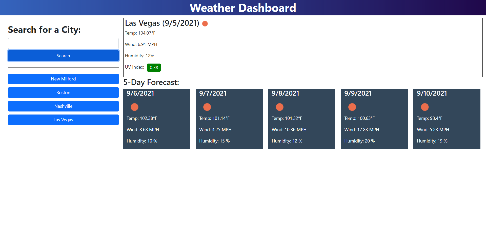

# Weather App
- Type in the name of a city and get the current weather and the 5-day forcast
- That city is added as a button under the search area
- Click the button to bring up that cities weather
- Previous cities search is persistent through page reload

## Repository and deployed application
- [Repository](https://github.com/SteveB29/weather-dashboard)
- [Deployed application](https://steveb29.github.io/weather-dashboard/)

## Screenshot
